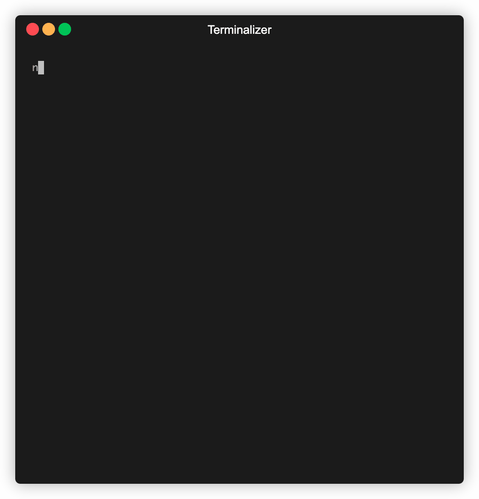

# **:triangular_flag_on_post: @IBBATTA/README GENERATOR**


/badge.svg)

> This project was born to simplify my workflow and satisfy my desire for knowledge. Being a curious (and also lazy) developer, I've always wandered how to avoid wasting time writing README.md files that fit perfectly project after project. That's why I wrote this tool to help simplify and speed up this process!



---

## **:clipboard: User usage**

- To install globally: `npm i -g @ibbatta/readme-generator`.
- To install locally: `npm i --save-dev @ibbatta/readme-generator`.

Just run `readme-generator` (or `npx readme-generator`) at the root of your project and follow the prompts!

You can add the following options:

| Option         | Description                                  | Default                     |
| -------------- | -------------------------------------------- | --------------------------- |
| -V, --version  | output the version number                    |                             |
| -h, --help     | output usage information                     |                             |
| -E, --entry    | specify the entry file                       | `package.json`              |
| -O, --output   | specify the output file                      | `README.md`                 |
| -T, --template | specify the path for you own README template | `internal default template` |
| -D, --debug    | log output readme data                       | `false`                     |

The tools will look for the **name**, **version**, **description**, **respository**, **author**, **engines**, **dependencies** and **contributors** data inside you package.json and then will generate the README.md file based on that information.

Due to this reason, this tool was create mainly for a node based project as it will take the package.json by default.\
If your project doesn't have a package.json, you can specify another json file.

_NOTE_: To generate a complete `README.md`, make sure that the structure of your `package.json` (or you entry file) looks like this:

```js
{
    "name": ...,
    "version": ...,
    "description": ...,
    "repository": {
        "url": ...
    },
    "author": {
        "name": ...,
        "email": ...,
        "url": ...
    },
    "contributors": [{
        "name": ...,
        "url": ...
    }],
    "engines": {
       ...
    },
    "dependencies": {
        ...
    }
}

```

_If no entry file is specified, and package.json is missing, the tool will prompt you for information instead._

You can include a custom field for your social accounts simply adding a `readmeGenerator` param inside `package.json`, like in this following example:

```js
{
  "name": ...,
  "version": ...,
  "description": ...,
  ...,
  ...,
  ...,
  "readmeGenerator": {
    "social": {
        "github": "http://github.com/...",
        "twitter": "http://twitter.com/...",
        "ADD MORE SOCIAL ACCOUNTS IF YOU WANT": "..."
    }
  }
}
```

This allows the tool to create a better `README.md` with more information.

Here is a generated [README example](https://github.com/ibbatta/readme-generator/blob/master/EXAMPLE-README.md).

---

## **:wrench: Developer usage**

### **Set up project**

Before cloning the repo **make sure** you have installed:

- [**NODE**](https://www.google.com/search?q=how+to+install+node) (version >= 8.9.x)
- [**YARN**](https://www.google.com/search?q=how+to+install+yarn) (version >= 1.9.x)
- [**NPM**](https://www.google.com/search?q=how+to+install+npm) (version >= 6.3.x)

Then:

- Choose a folder project in your system and switch in `cd [folder path]`
- Clone the repo in your folder: `git clone https://github.com/ibbatta/readme-generator.git`

---

### **Installation**

First, enter the project folder and run `nvm use` to check you have the right node version, then run `yarn install` to install all the dependencies.

---

#### Start the project

To run the cli of the project locally:

```bash
npm start
# or
yarn start
```

#### Build the project for production

This will create a folder `/lib` and compile the es6 / es7 js syntax:

```bash
npm build
#or
yarn build
```

You can add the `--watch` flag if you want to keep watching the changes made for test files.

#### Run the tests

```bash
npm test
#or
yarn test
```

You can add the `--watch` flag if you to want keep watching the changes made for test files.

---

## **Editor setup**

To keep the style of resources consistent, I decided to stick to some shared rules that have to be applied to every
project using some editors plugins. Plese be sure to disable / remove any other js/jsx linters or custom configurations.

### Eslint

I have chosen to use [Eslint](https://eslint.org/) to lint the Javascript / React [.js / .jsx] syntax.
It includes a `.eslintrc` file in the root directory. Make sure your editor has the right plugins.

### Auto correction on save

I have chosen to use [js-beautify](https://github.com/beautify-web/js-beautify/) as the beautifier for the HTML and CSS.
It includes a `.jsbeautifyrc` file in the root directory. Make sure your editor has the right plugins.

### Basic Editor Configuration

I have chosen to use [EditorConfig](https://editorconfig.org/) to share the basic configuration like indentation and
charset.
It includes a `.editorconfig` file in the root directory. Make sure your editor has the right plugins.

### Prettier

I have chosen to use [Prettier](https://prettier.io/) to ensure the codebase has a consistent style.
It includes a `.prettierrc` file in the root directory. Make sure your editor has the right plugin.

---

## **:handshake: Contributing**

Contributions, issues and feature requests are welcome.
Feel free to check the issues page if you want to contribute, and follow these simple steps:

- Fork it!
- Create your feature (or fix) branch: `git checkout -b my-new-feature`
- Commit your changes: `git commit -am 'Add some feature'`
- Push to the branch: `git push origin my-new-feature`
- Submit a pull request!

---

### **:anger: Troubleshooting**

This is just a personal project created for study / demonstration purposes and to simplify my working life, it may or may not be a good fit for your project!

---

### **:heart: Show your support**

Please :star: this repository if you like it or this project helped you!\
Feel free to open issues or submit pull-requests to help me improve my work.

<a href="https://www.patreon.com/ibbatta" target="_blank">
  
</a>

---

### **:robot: Author**

Maurizio Battaghini

> GitHub [@ibbatta](https://github.com/ibbatta) &nbsp;&middot;&nbsp;
> Twitter [@battago](https://twitter.com/battago)

---

Copyright © 2019 [Maurizio Battaghini](https://github.com/ibbatta).\
This project is covered by [MIT](https://github.com/ibbatta/readme-generator/blob/master/LICENSE) license.
